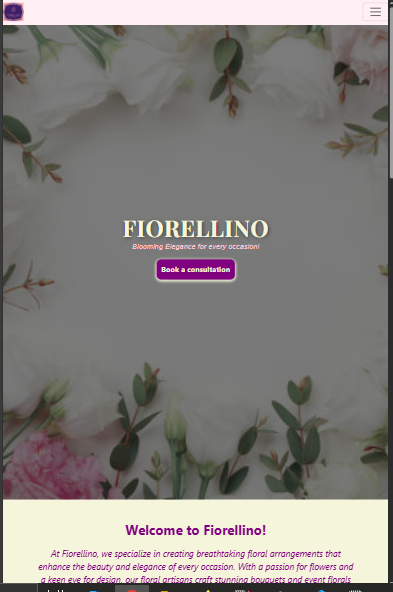
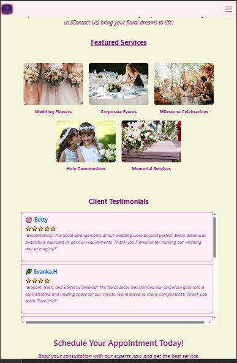
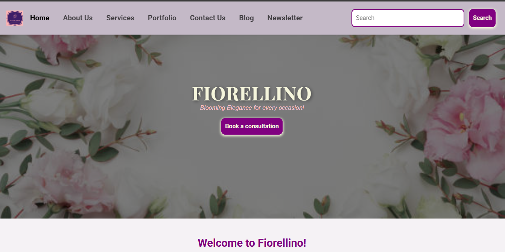
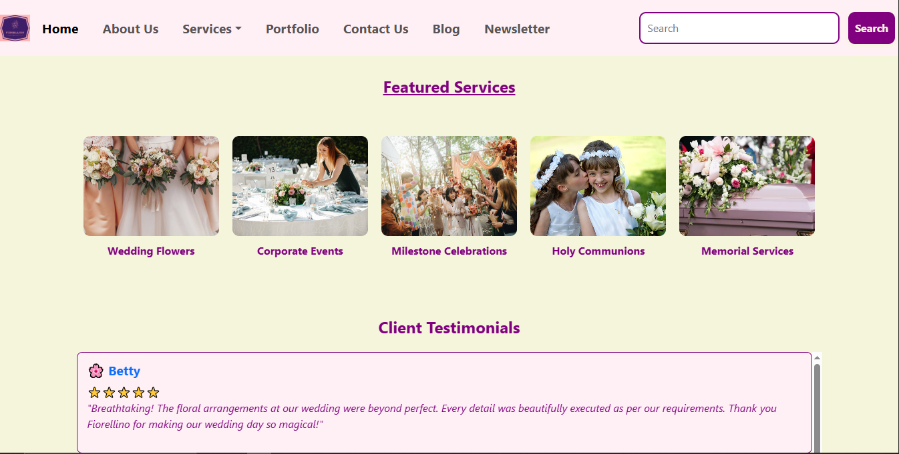
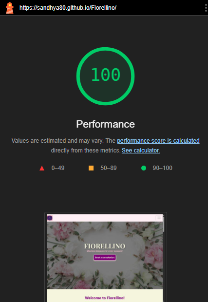
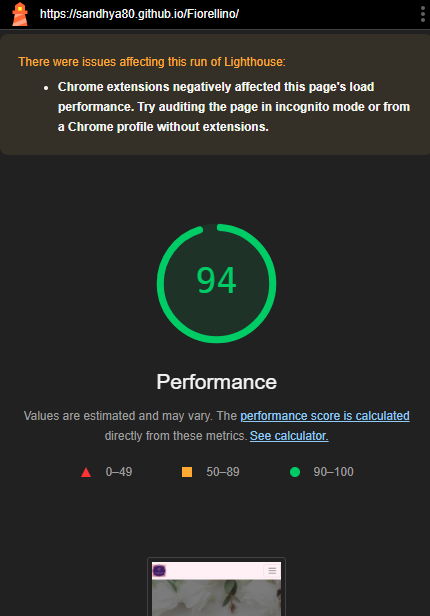
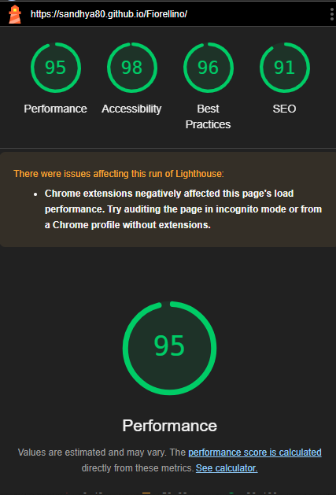
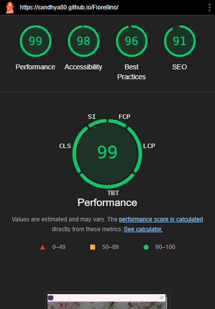

# Fiorellino - Event Florist Website 🌸

Welcome to **Fiorellino**, a beautifully designed website for showcasing breathtaking floral arrangements for weddings, corporate events, and special celebrations. This project is built to provide an elegant and user-friendly experience for visitors, highlighting the services, testimonials, blog posts, and more.

---

## 🌟 Features

**Homepage**: A visually appealing landing page with a banner, featured services, testimonials, and blog snippets.
**Services Section**: Detailed pages for various services like weddings, corporate events, private events, and more.
**Testimonials**: A scrollable section showcasing client reviews and ratings.
**Blog Section**: Latest blog posts with links to a dedicated blog page.
**Contact Us**: A call-to-action section for booking consultations.
**Responsive Design**: Fully responsive and optimized for all devices (mobile, tablet, and desktop).
**Footer**: Includes company links, ethics, services, customer support, and social media icons.

---

## 🛠️ Technologies Used

**HTML5**: For structuring the content.
**CSS3**: For styling and layout.
**Bootstrap 5**: For responsive design and prebuilt components.
**Font Awesome**: For icons.
**Google Fonts**: For typography.
**JavaScript**: For interactivity and functionality.

---

## 📂 Folder Structure

Fiorellino/
├── index.html               # Homepage
├── about.html               # About Us page
├── blog.html                # Blog page
├── contactUs.html           # Contact Us page
├── services/                # Folder for service-specific pages
│   ├── wedding.html
│   ├── corporate-events.html
│   ├── private-events.html
│   ├── holy-communions.html
│   └── funeral-flowers.html
├── css/                     # Stylesheets
│   ├── styles.css
│   ├── blog.css
│   └── responsive.css
├── assets/                  # Images and other assets
│   ├── homepage_imgs/
│   ├── blog_imgs/
│   └── service_imgs/
└── js/                      # JavaScript files
	└── main.js

---

## 🚀 How to Run the Project

1. Clone the repository:

```bash
git clone https://github.com/sandhya80.github.io/fiorellino.git
cd fiorellino
```

Open index.html in your browser to view the website.

🌐 Live Demo
Check out the live version of the website here: <https://sandhya80.github.io/Fiorellino/>

📸 Screenshots

1. For Small Screens:

Homepage banner for small screens:


Homepage/services for small screens:


2. For Medium Screens:

Homepage banner for medium screens:



Homepage/services for medium screens:




3. For Large Screens:

Homepage banner for large screens:



Homepage/services for large screens:



---

## 🐞 Bug Fixes

Several issues were identified and resolved in the **Fiorellino Blog Page** to enhance performance, accessibility, best practices, and SEO:

1. **Performance Improvements**:
   - Added `loading="lazy"` to all images to enable lazy loading, reducing initial page load time.
   - Used `defer` for non-critical JavaScript files to prevent render-blocking.

2. **Accessibility Fixes**:
   - Added descriptive `alt` attributes to all images for better screen reader support.
   - Ensured proper ARIA roles for navigation elements.

3. **Best Practices**:
   - Replaced `<link>` tags in the footer with `<a>` tags for proper functionality.
   - Added `rel="noopener noreferrer"` to external links to prevent security vulnerabilities.

4. **SEO Enhancements**:
   - Added structured data (`JSON-LD`) for the blog page to improve search engine visibility.
   - Optimized meta tags with relevant keywords and descriptions.

These fixes ensure a faster, more user-friendly, and SEO-optimized experience for visitors across all devices.

---

## 📊 Performance

This project is optimized for fast loading times and smooth user experience across all devices. Below are the performance metrics and screenshots showcasing the results:

### Lighthouse Performance Report

1. **Performance Score**: Achieved a high performance score on Google Lighthouse.
2. **Accessibility**: Ensures accessibility for all users.
3. **Best Practices**: Adheres to modern web development standards.
4. **SEO**: Optimized for search engines.

### Screenshots

1. **Lighthouse Performance Report**:

For Smaller Screen (Mobile devices - on InCognito mode)



For Larger Screen (Tablet & Desktop - with Chrome extensions)



2. **Page Load Time**:



3. **Mobile Responsiveness Test**:




## 📜 License

This project is licensed strictly for **educational purposes only**. Any commercial use, redistribution, or modification of this project is prohibited without prior permission.

---

## 🙌 Credits

**Bootstrap**: For providing responsive design and prebuilt components. [Visit Bootstrap](https://getbootstrap.com/)
**Unsplash**: For the beautiful images used in the project. [Visit Unsplash](https://unsplash.com/)
**Github Copilot**: For bug fixes and overall performance enhancements.

---

📧 Contact:

For any inquiries or feedback, feel free to reach out:

Email: <sandhyaharsh@gmail.com>

---

Thank you for visiting Fiorellino! 🌺
