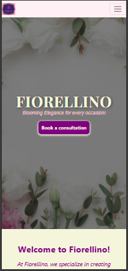

# Fiorellino - Event Florist Website

Welcome to **Fiorellino**, a beautifully designed website for showcasing breathtaking floral arrangements for weddings, corporate events, and special celebrations. This project is built to provide an elegant and user-friendly experience for visitors, highlighting the services, testimonials, blog posts, and more.

---

## Live Demo

Check out the live version of the website here:  
[https://sandhya80.github.io/Fiorellino/](https://sandhya80.github.io/Fiorellino/)

---

## Homepage Screenshot


---

## Table of Contents

1. [Live Demo](#live-demo)
2. [Homepage Screenshot](#homepage-screenshot)
3. [Features](#features)
4. [Technologies Used](#technologies-used)
5. [AI Influence on Workflow](#ai-influence-on-workflow)
6. [Color Palette](#color-palette)
7. [Folder Structure](#folder-structure)
8. [How to Run the Project](#how-to-run-the-project)
9. [Screenshots](#screenshots)
10. [Functionalities and User Benefits](#functionalities-and-user-benefits)
11. [Bug Fixes](#bug-fixes)
12. [Validation Methods](#validation-methods)
13. [Validation Screenshots](#validation-screenshots)
14. [Performance](#performance)
15. [Limitations](#limitations)
16. [Future Enhancements](#future-enhancements)
17. [License](#license)
18. [Credits](#credits)
19. [Contact](#contact)
20. [JavaScript Integration](#javascript-integration)

---

## Features

- **Homepage**: A visually appealing landing page with a banner, featured services, testimonials, and blog snippets.
- **Homepage Carousel**: A responsive carousel showcasing featured floral arrangements and highlights.
- **About Us Carousel**: A team carousel on the About Us page, fully responsive and perfectly rounded for all viewports.
- **Services Section**: Detailed pages for various services like weddings, corporate events, private events, and more.
- **Testimonials**: A scrollable section showcasing client reviews and ratings.
- **Blog Section**: Latest blog posts with links to a dedicated blog page.
- **Contact Us**: A call-to-action section for booking consultations.
- **Responsive Design**: Fully responsive and optimized for all devices (mobile, tablet, and desktop).
- **Footer**: Includes company links, ethics, services, customer support, and social media icons.
- **Login/Registration Pop-up**: A custom login and registration modal for "My Account" accessible from the footer, allowing users to register or log in with a notification for activation code sent on registration.

---

## Technologies Used

- **HTML5**: For structuring the content.
- **CSS3**: For styling and layout.
- **Bootstrap 5**: For responsive design and prebuilt components.
- **Font Awesome**: For icons.
- **Google Fonts**: For typography.
- **JavaScript**: For interactivity and functionality.

---

## AI Influence on Workflow

AI tools like GitHub Copilot significantly enhanced the development process by streamlining bug fixes, optimizing performance, and improving accessibility and SEO. It provided intelligent code suggestions, automated repetitive tasks, and ensured adherence to best practices, resulting in a more efficient workflow and a polished final product.

---

## Color Palette

The Fiorellino website uses the following color palette to create an elegant and visually appealing design:

| Color Name         | Hex Code   | Usage                                   |
|--------------------|------------|-----------------------------------------|
| Floral Pink        | `#FFC0CB`  | Highlights, buttons, and accents        |
| Pastel Green       | `#98FB98`  | Backgrounds and subtle sections         |
| Ivory White        | `#FFFFF0`  | Main background color                   |
| Charcoal Gray      | `#333333`  | Text and headings                       |
| Soft Gold          | `#FFD700`  | Decorative elements and icons           |
| Light Lavender     | `#E6E6FA`  | Secondary backgrounds and hover effects |
| Deep Burgundy      | `#800020`  | Footer background and strong accents    |

This palette ensures a cohesive and elegant aesthetic, reflecting the brand's floral and sophisticated theme.

---

## Folder Structure

```plaintext
Fiorellino/
├── index.html               # Homepage
├── about.html               # About Us page
├── blog.html                # Blog page
├── contactUs.html           # Contact Us page
├── services/                # Folder for service-specific pages
│   ├── wedding.html
│   ├── corporate-events.html
│   ├── private-events.html
│   ├── holy-communions.html
│   └── funeral-flowers.html
├── css/                     # Stylesheets
│   ├── styles.css
│   ├── blog.css
│   └── responsive.css
├── assets/                  # Images and other assets
│   ├── homepage_imgs/
│   ├── blog_imgs/
│   └── service_imgs/
└── js/                      # JavaScript files
    └── script.js
```plaintext

---

## How to Run the Project

1. Clone the repository:

   ```bash
   git clone https://github.com/sandhya80.github.io/fiorellino.git
   cd fiorellino
   ```

2. Open `index.html` in your browser to view the website.

---

## Screenshots

**For Small Screens:**

Homepage banner for small screens:



Homepage/services for small screens:


**For Medium Screens:**

Homepage banner for medium screens:


Homepage/services for medium screens:


**For Large Screens:**

Homepage banner for large screens:


Homepage/services for large screens:


---

## Functionalities and User Benefits

- **Visually Appealing Banner**: Captures user attention with a high-quality floral image and a call-to-action button for quick navigation.
- **Featured Services Section**: Highlights key services like weddings, corporate events, and private celebrations, making it easy for users to explore offerings.
- **Homepage Carousel**: Engages users with a dynamic, responsive carousel of featured floral arrangements.
- **About Us Carousel**: Introduces the team with a responsive, perfectly rounded carousel for all viewports.
- **Testimonials Section**: Displays client reviews in a scrollable format, building trust and credibility with potential customers.
- **Blog Snippets**: Showcases the latest blog posts with links to detailed articles, keeping users engaged with fresh content.
- **Responsive Design**: Ensures seamless browsing across devices (mobile, tablet, and desktop), enhancing user experience.
- **Quick Contact Section**: Includes a "Contact Us" call-to-action for easy booking of consultations or inquiries.
- **Login/Registration Pop-up**: Allows users to log in or register for a "My Account" directly from the footer, with a notification for activation code sent on registration.

These features provide an intuitive and engaging experience, helping users quickly find the information they need.

---

## Bug Fixes

Several issues were identified and resolved in the **Fiorellino Blog Page** with the help of GitHub Copilot to enhance performance, accessibility, best practices, and SEO:

1. **Performance Improvements**:
   - Added `loading="lazy"` to all images to enable lazy loading, reducing initial page load time.
   - Used `defer` for non-critical JavaScript files to prevent render-blocking.

2. **Accessibility Fixes**:
   - Added descriptive `alt` attributes to all images for better screen reader support.
   - Ensured proper ARIA roles for navigation elements.

3. **Best Practices**:
   - Replaced `<link>` tags in the footer with `<a>` tags for proper functionality.
   - Added `rel="noopener noreferrer"` to external links to prevent security vulnerabilities.

4. **SEO Enhancements**:
   - Added structured data (`JSON-LD`) for the blog page to improve search engine visibility.
   - Optimized meta tags with relevant keywords and descriptions.

These fixes ensure a faster, more user-friendly, and SEO-optimized experience for visitors across all devices.

---

## Validation Methods

To ensure the Fiorellino website adheres to modern web standards and delivers an optimal user experience, the following validation methods were used:

1. **HTML Validation**: Verified using [W3C Markup Validation Service](https://validator.w3.org/) to ensure semantic and error-free HTML code.
2. **CSS Validation**: Checked with [W3C CSS Validation Service](https://jigsaw.w3.org/css-validator/) to confirm proper syntax and compatibility.
3. **Performance Testing**: Conducted using Google Lighthouse to optimize loading times, reduce render-blocking resources, and improve overall performance.
4. **Accessibility Testing**: Evaluated with Lighthouse and [Wave Accessibility Tool](https://wave.webaim.org/) to ensure compliance with WCAG standards.
5. **Best Practices**: Assessed through Lighthouse to adhere to modern web development standards and security practices.
6. **SEO Validation**: Optimized and tested with Lighthouse to ensure proper meta tags, structured data, and search engine visibility.

These validation methods guarantee a high-quality, user-friendly, and accessible website for all users.

---

## Validation Screenshots

Below are the screenshots showcasing the validation results for HTML and CSS:

1. **HTML Validation**: Verified using [W3C Markup Validation Service](https://validator.w3.org/).

   

2. **CSS Validation**: Checked with [W3C CSS Validation Service](https://jigsaw.w3.org/css-validator/).

   

3. **JS Validation**: JavaScript was validated using [JSHint](https://jshint.com/) and [ESLint](https://eslint.org/) for code quality and error checking. 

---

---

## Performance

This project is optimized for fast loading times and smooth user experience across all devices. Below are the performance metrics and screenshots showcasing the results:

### Lighthouse Performance Report

1. **Performance Score**: Achieved a high performance score on Google Lighthouse.
2. **Accessibility**: Ensures accessibility for all users.
3. **Best Practices**: Adheres to modern web development standards.
4. **SEO**: Optimized for search engines.

### Performance Report Screenshots

- **Lighthouse Performance Report**:

  For Smaller Screen (Mobile devices - on Incognito mode):

  

  For Larger Screen (Tablet & Desktop - with Chrome extensions):

  

- **Page Load Time**:

  

- **Mobile Responsiveness Test**:

  

---

## Limitations

- The website currently lacks **e-commerce functionality** for purchasing floral arrangements and event packages.
- **User accounts** and personalized features, such as order tracking, are not yet implemented.
- The blog section does not include **interactive features** like commenting or social sharing.
- **Multilingual support** is unavailable, limiting accessibility for a global audience.
- No **AI-powered recommendations** are in place to suggest floral arrangements based on user preferences.
- The absence of a **calendar-based event booking system** restricts scheduling consultations directly on the website.
- **Newsletter subscription** functionality is not yet integrated for user engagement.

These limitations will be addressed in future updates to enhance the website's functionality and user experience.

---

## Future Enhancements

1. **E-commerce Integration**: Add an online store for purchasing floral arrangements and event packages.
2. **User Accounts**: Enable user registration and login for personalized experiences and order tracking.
3. **Advanced Blog Features**: Include a commenting system and social sharing options for blog posts.
4. **Multilingual Support**: Provide content in multiple languages to cater to a global audience.
5. **AI-Powered Recommendations**: Implement AI to suggest floral arrangements based on user preferences and occasions.
6. **Event Booking System**: Add a calendar-based booking system for scheduling consultations and events.
7. **Newsletter Subscription**: Allow users to subscribe to newsletters for updates and promotions.

These enhancements aim to improve user engagement, functionality, and global reach.

---

## License

This project is licensed strictly for **educational purposes only**. Any commercial use, redistribution, or modification of this project is prohibited without prior permission.

---

## Credits

- **Bootstrap**: For providing responsive design and prebuilt components. [Visit Bootstrap](https://getbootstrap.com/)
- **Unsplash**: For the beautiful images used in the project. [Visit Unsplash](https://unsplash.com/)
- **GitHub Copilot**: For bug fixes and overall performance enhancements.

---

## Contact

For any inquiries or feedback, feel free to reach out:

Email: <sandhyaharsh@gmail.com>

---

Thank you for visiting Fiorellino!

---

## JavaScript Integration

The project now includes a dedicated JavaScript file:  
**`js/script.js`**

### Features & Logic Implemented

#### 1. Modal Functionality for "My Account"

- Handles opening and closing of the login/register modal from the footer.
- Allows switching between login and registration sections within the modal.
- Closes the modal when clicking outside the modal content.
- Demo form submissions for login and registration, with alert feedback.

#### 2. Service Card Flip Animation

- Enables interactive flipping of service cards on the Services page.
- Ensures only one card is flipped at a time for a clean user experience.

#### 3. Newsletter Subscription Modal

- Handles the display of a "Thank You" modal upon successful newsletter subscription form submission.

#### 4. Navbar Search Functionality

- Implements a search bar in the navbar.
- Highlights the first matching keyword found on the page.
- Alerts the user if no results are found.

#### 5. Contact Us Booking Form

- Handles form validation and submission for the booking form.
- Displays a confirmation modal upon successful submission.
- Resets the form after submission and provides validation feedback if the form is incomplete.

---

### File Structure (Relevant to JavaScript)

```
/js
  └── script.js
```

---

### How to Use

- All JavaScript logic is included via `js/script.js` and is automatically loaded on each page.
- No additional configuration is required.

---

### Credits

- Bootstrap for modal and UI components.
- Font Awesome for icons.

---

For more details on each feature, please refer to the code comments in `js/script.js`.
